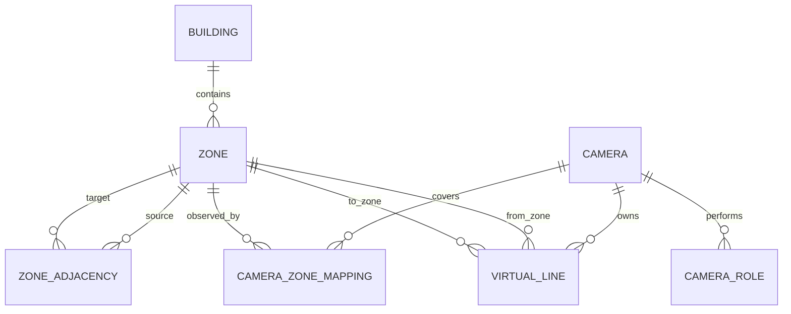

# Phase 2 — Factory Topology and Virtual-Line Configuration

Tanggal verifikasi: 24 Juli 2026
Branch: `cctv/versi-1`
Migration head: `0010_factory_topology`

## Hasil

Phase 2 selesai. Sistem kini mempunyai model lokasi dan topologi terstruktur
untuk pilot multi-kamera, tanpa menghapus atau memutus konfigurasi kamera lama.

Konsep yang dibangun:

- Building.
- Zone dengan atribut floor, area, dan room.
- Camera role yang dapat ditambah tanpa hardcode.
- Camera coverage ke satu atau beberapa zona.
- Directed zone adjacency dengan batas waktu perjalanan.
- Virtual line dengan zona asal/tujuan.
- Validasi topologi untuk menolak hubungan yang secara fisik tidak mungkin.

`VirtualLine` juga menjadi transition point. Tabel terpisah tidak dibuat karena
camera, geometri, arah, zona asal, dan zona tujuan sudah membentuk satu titik
transisi yang lengkap.

## Model data



Constraint penting:

- kode gedung unik;
- kode zona unik per gedung;
- satu role tertentu hanya sekali per kamera;
- satu mapping kamera–zona hanya sekali;
- maksimal satu zona utama per kamera;
- maksimal satu virtual line utama per kamera;
- adjacency tidak boleh menghubungkan zona ke dirinya sendiri;
- waktu maksimum perjalanan tidak boleh lebih kecil dari minimum;
- geometri memakai koordinat normalized `0..1`;
- virtual line internal hanya dapat menghubungkan adjacency yang aktif;
- kamera virtual line harus mencakup minimal salah satu zona endpoint.

## Strategi kompatibilitas

Kolom lama `Camera.building`, `floor`, `zone`, dan `crossing_config` tetap ada.
Migration mengubah data teks lama menjadi Building, Zone, CameraZoneMapping,
dan VirtualLine awal.

Saat konfigurasi normalized berubah:

- zona utama menyinkronkan label lokasi kamera lama;
- virtual line utama menyinkronkan `crossing_config`;
- endpoint lama `GET/PUT /camera/{id}/crossing-config` membaca/menulis virtual
  line utama.

Pipeline realtime saat ini memproses satu crossing configuration per kamera,
yaitu virtual line yang ditandai utama. Database dan API sudah mendukung banyak
virtual line; eksekusi beberapa line sekaligus masuk ke Phase 5 ketika local
tracking dan zone transition dibangun.

## API

Semua read endpoint membutuhkan JWT. Mutasi hanya dapat dilakukan oleh role
lama `SUPER_ADMIN` dan `ADMIN`.

```text
GET|POST           /api/v1/topology/buildings
PATCH|DELETE       /api/v1/topology/buildings/{id}
GET|POST           /api/v1/topology/zones
PATCH|DELETE       /api/v1/topology/zones/{id}
GET|POST           /api/v1/topology/camera-roles
PATCH|DELETE       /api/v1/topology/camera-roles/{id}
GET|POST           /api/v1/topology/camera-zone-mappings
PATCH|DELETE       /api/v1/topology/camera-zone-mappings/{id}
GET|POST           /api/v1/topology/adjacencies
PATCH|DELETE       /api/v1/topology/adjacencies/{id}
GET|POST           /api/v1/topology/virtual-lines
PATCH|DELETE       /api/v1/topology/virtual-lines/{id}
GET                /api/v1/topology/graph
GET                /api/v1/topology/validate
```

Gedung dan zona diarsipkan dengan `enabled=false`, bukan dihapus fisik. Setiap
mutasi dicatat ke `audit_logs`.

## Dashboard

Menu baru tersedia di:

```text
Administrasi → Topologi fasilitas
```

Tiga workbench:

1. Gedung & zona.
2. Peran & cakupan kamera.
3. Jalur & virtual line.

Dashboard menampilkan readiness topologi, masalah konfigurasi, jumlah gedung,
zona, cakupan, dan jalur. Input polygon memakai koordinat normalized agar tidak
bergantung pada resolusi CCTV.

## Backup

Archive observasional naik ke schema version 3 dan kini membawa:

- buildings;
- zones;
- camera_roles;
- camera_zone_mappings;
- zone_adjacencies;
- virtual_lines.

Import schema version 1 dan 2 tetap dapat dibaca.

## Struktur file Phase 2

```text
app/
├── api/
│   ├── routes/topology.py
│   └── topology_schemas.py
├── models/
│   ├── entities.py
│   └── topology_rules.py
├── repository/
│   └── topology_repository.py
└── services/
    └── topology_service.py
alembic/versions/
└── 0010_factory_topology.py
dashboard/src/
├── components/
│   └── TopologyAdministration.jsx
├── topology.js
└── topology.test.js
tests/
└── test_topology_phase2.py
```

## Verifikasi

- Ruff: lulus.
- Backend: 158 test lulus.
- Dashboard: 9 test lulus.
- Vite production build: lulus.
- Migration database kosong: `base → 0010` lulus.
- Migration rollback sementara: `0010 → 0009 → 0010` lulus.
- Migration database kerja: berada di `0010_factory_topology`.
- Docker Compose: API, dashboard, dan PostgreSQL healthy.
- Visual QA: desktop lulus.
- Responsive QA: 320, 375, 414, dan 768 px tanpa horizontal overflow.
- Login stale-response race: diperbaiki dan diverifikasi tanpa alert lama.

Peringatan nonblocking: bundle JavaScript dashboard sekitar 543 kB sebelum
gzip. Phase berikutnya sebaiknya memecah halaman administrasi dengan dynamic
import agar initial monitoring bundle lebih kecil.

## Batas Phase 2

Belum dibangun pada phase ini:

- capture event dan evidence baru (Phase 3);
- async AI job queue (Phase 4);
- multi-line zone transition runtime (Phase 5);
- department permission dan PPE policy (Phase 10);
- global journey dan impossible-travel correlation (Phase 8).

Fondasi schema topologi yang dibutuhkan phase tersebut sudah tersedia.
