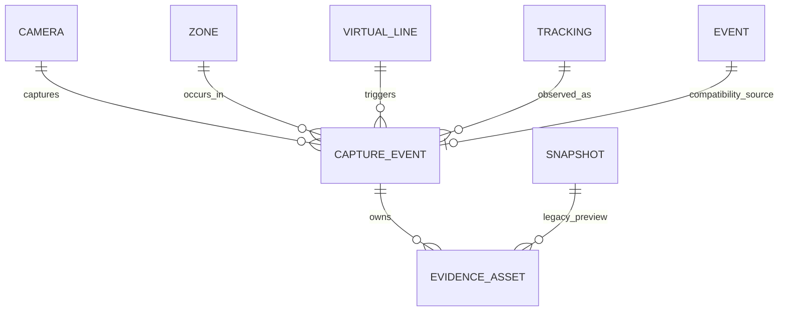

# Phase 3 — Capture Event and Evidence Storage

Tanggal verifikasi: 24 Juli 2026
Branch: `cctv/versi-1`
Migration head: `0011_capture_evidence`

## Hasil

Phase 3 menambahkan capture envelope dan penyimpanan evidence immutable tanpa
menghapus kontrak `Event`, `Snapshot`, maupun endpoint dashboard lama.

Saat satu crossing diterima, sistem sekarang membuat:

1. original snapshot;
2. annotated snapshot sebagai preview utama;
3. full-body crop;
4. thumbnail;
5. metadata JSON versi 2.

Penulisan file dijalankan di thread terpisah agar event loop kamera tidak
terblokir. Setiap file ditulis ke temporary file, disinkronkan, lalu
dipublikasikan dengan hard link atomik yang gagal jika target sudah ada.

## Model data



`capture_events` menyimpan:

- idempotency key unik;
- kamera, zona, virtual line, dan tracking;
- status capture;
- direction, bounding box, centroid, dan quality;
- timestamp capture dan lifecycle processing;
- error serta attempt count.

`evidence_assets` menyimpan:

- jenis dan sequence asset;
- immutable relative storage key;
- checksum SHA-256;
- integrity status;
- MIME type, ukuran, dimensi, dan durasi;
- primary marker dan retention deadline.

Trigger PostgreSQL menolak perubahan pada capture identity, asset type,
sequence, storage key, capture timestamp, dan checksum yang sudah terenrol.
Asset legacy dengan checksum kosong hanya boleh mengenrol checksum satu kali.

## Status

Status capture yang sudah tersedia untuk pipeline berikutnya:

```text
CAPTURED
QUEUED
PROCESSING
COMPLETED
NEED_REVIEW
FAILED
RETRYING
CANCELLED
```

Phase 3 menghasilkan `CAPTURED` ketika bundle tersimpan dan `FAILED` ketika
capture tidak berhasil. Transisi queue dan processing akan dipakai Phase 4.

Integrity status asset:

```text
VERIFIED
UNVERIFIED
MISSING
CORRUPT
```

## Kompatibilitas dan backfill

Tabel lama `events` dan `snapshots` tetap menjadi kontrak dashboard yang sudah
berjalan. Satu transaksi crossing sekarang menyimpan record lama dan record
Phase 3 secara bersamaan.

Migration membackfill data lama sebagai berikut:

- ID capture event memakai ID event lama;
- idempotency key memakai `legacy-event:<event-id>`;
- kamera dan tracking diambil dari event lama;
- zona dan virtual line dicocokkan dari topologi Phase 2;
- snapshot serta metadata menjadi evidence asset;
- checksum lama dibiarkan kosong dengan status `UNVERIFIED`.

Pada database aktif, 16 event lama berhasil menjadi 16 capture event,
16 annotated asset, dan 16 metadata asset tanpa kehilangan record lama.

## Storage dan keamanan

Storage key baru selalu relatif terhadap `STORAGE_PATH`:

```text
storage/
└── YYYY/
    └── MM/
        └── DD/
            ├── YYYYMMDD_HHMMSS_UUID_original.jpg
            ├── YYYYMMDD_HHMMSS_UUID.jpg
            ├── YYYYMMDD_HHMMSS_UUID_body.jpg
            ├── YYYYMMDD_HHMMSS_UUID_thumb.jpg
            └── YYYYMMDD_HHMMSS_UUID.json
```

Perlindungan yang diterapkan:

- penolakan absolute key dan `..`;
- target file tidak boleh ditimpa;
- temporary write + no-overwrite publish atomik;
- permission file `0640`;
- checksum SHA-256;
- metadata API tidak mengekspos path/storage key;
- signed bearer grant 10–300 detik;
- token terikat asset, user, token version, dan grant ID;
- content-type allowlist dan `X-Content-Type-Options: nosniff`;
- grant, view, dan integrity verification diaudit.

## API

Semua endpoint membutuhkan JWT. Integrity verification dibatasi ke
`SUPER_ADMIN`, `ADMIN`, dan `AUDITOR`.

```text
GET  /api/v1/capture-events
GET  /api/v1/capture-events/{capture_event_id}
GET  /api/v1/capture-events/{capture_event_id}/assets
POST /api/v1/capture-events/assets/{asset_id}/verify
POST /api/v1/evidence/assets/{asset_id}/access
GET  /api/v1/evidence/assets/{asset_id}/content
```

Filter list capture:

- camera ID;
- zone ID;
- status;
- start/end timestamp;
- offset/limit.

## Backup

Archive observasional naik ke schema version 4 dan membawa:

- `capture_events.jsonl`;
- `evidence_assets.jsonl`;
- file evidence di bawah `media/evidence/<capture-event-id>/`.

Import schema version 1, 2, dan 3 tetap dapat divalidasi dan dibaca.

## Struktur file Phase 3

```text
app/
├── api/
│   ├── capture_schemas.py
│   └── routes/
│       ├── capture_events.py
│       └── evidence.py
├── models/
│   └── entities.py
├── repository/
│   ├── capture_evidence_repository.py
│   └── pipeline_repository.py
├── services/
│   ├── capture_evidence_service.py
│   └── evidence_access_service.py
└── storage/
    ├── evidence_storage_service.py
    └── snapshot_service.py
alembic/versions/
└── 0011_capture_evidence.py
tests/
├── test_capture_event_routes.py
└── test_capture_evidence_phase3.py
```

## Verifikasi

- Ruff: lulus.
- Backend: 167 test lulus.
- Migration database kosong: `base → 0011` lulus.
- Rollback database sementara: `0011 → 0010 → 0011` lulus.
- Database sementara sudah dihapus.
- Database aktif: `0011_capture_evidence`.
- Backfill database aktif: 16 capture event dan 32 evidence asset.
- API, dashboard, dan PostgreSQL: healthy.
- Readiness API: `{"status":"ok"}`.
- Endpoint Phase 3 terdaftar pada OpenAPI.

## Batas Phase 3

Belum dibangun pada phase ini:

- durable asynchronous processing queue (Phase 4);
- multi-line local zone transition runtime (Phase 5);
- face/periocular candidate generation (Phase 6);
- body ReID dan APD analysis (Phase 7);
- video pre/post-event ring buffer;
- automatic retention deletion worker.

Jenis asset untuk face, periocular, dan video sudah disediakan agar phase
berikutnya tidak memerlukan perubahan fondasi storage. Retention deadline sudah
tersimpan, tetapi penghapusan otomatis harus menunggu kebijakan dan worker yang
diaudit.
