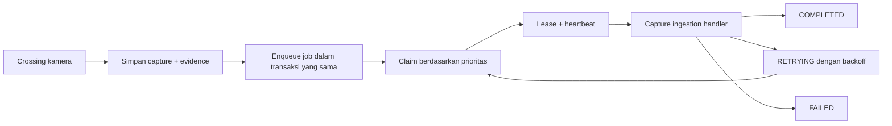

# Phase 4 — Asynchronous Queue and AI Processing Jobs

Tanggal verifikasi: 24 Juli 2026

Branch: `cctv/versi-1`

Migration head: `0012_async_processing_jobs`

## Hasil

Phase 4 menambahkan antrean AI asynchronous yang durable tanpa menambah
infrastruktur baru. PostgreSQL dipilih untuk tahap pilot karena capture,
evidence, dan job dapat dibuat dalam satu transaksi serta tetap konsisten saat
API atau worker restart.

Alur yang aktif:



Handler Phase 4 hanya memvalidasi bahwa capture memiliki evidence aktif dan
primary asset. YOLO, korelasi identitas, okupansi, dan policy jobs tetap menjadi
phase berikutnya agar batas tanggung jawab tetap jelas.

## Konsistensi dan idempotensi

- Capture, evidence, event kompatibilitas, snapshot, dan job disimpan dalam
  transaksi database yang sama.
- `idempotency_key` job unik memakai format
  `capture-ingestion:<capture-event-id>`.
- Claim memakai `FOR UPDATE SKIP LOCKED`, sehingga beberapa worker aman
  mengonsumsi queue yang sama.
- Penyelesaian dan kegagalan hanya diterima dari `worker_id` pemilik lease.
- Job yang sudah terminal tidak dapat dibatalkan lagi.
- Manual retry hanya tersedia untuk job `FAILED` atau `CANCELLED` dan tercatat
  pada audit log.

## Lifecycle dan recovery

Status job:

```text
QUEUED
PROCESSING
RETRYING
COMPLETED
FAILED
CANCELLED
```

Saat claim, worker menambah `attempt_count`, menetapkan pemilik lease, waktu
kedaluwarsa, dan heartbeat. Heartbeat memperpanjang lease selama handler masih
berjalan. Recovery berkala mengubah lease yang kedaluwarsa menjadi `RETRYING`;
jika batas percobaan habis, job dan capture menjadi `FAILED`.

Retry otomatis memakai exponential backoff yang dibatasi oleh
`AI_RETRY_MAX_DELAY_SECONDS`. Error deterministik seperti capture tanpa evidence
langsung menjadi terminal dan tidak diulang.

## Prioritas

Urutan claim adalah:

1. `HIGH` untuk zona restricted/secret;
2. `NORMAL` untuk area operasional umum;
3. `LOW` untuk reprocessing atau histori.

Di dalam prioritas yang sama, job tersedia paling lama diproses lebih dahulu.
Prioritas capture diambil dari konfigurasi zona.

## Observability

`capture_events` sekarang merekam:

- processing start dan completion timestamp;
- dashboard update timestamp;
- end-to-end processing latency;
- retry count;
- failure reason.

API menyediakan jumlah per status, backlog, job aktif, job gagal, umur job
tertua, dan rata-rata latency:

```text
GET  /api/v1/processing-jobs
GET  /api/v1/processing-jobs/statistics
GET  /api/v1/processing-jobs/{job_id}
POST /api/v1/processing-jobs/{job_id}/retry
POST /api/v1/processing-jobs/{job_id}/cancel
```

Endpoint baca memerlukan login. Retry dan cancel dibatasi untuk
`SUPER_ADMIN`/`ADMIN` dan diaudit. Payload daftar tidak mengekspos lease owner
atau idempotency key internal.

## Konfigurasi

Semua nilai berasal dari `.env`:

```text
ENABLE_AI_WORKER
AI_WORKER_ID
AI_WORKER_CONCURRENCY
AI_QUEUE_POLL_INTERVAL_SECONDS
AI_JOB_LEASE_SECONDS
AI_JOB_HEARTBEAT_SECONDS
AI_JOB_TIMEOUT_SECONDS
AI_JOB_MAX_ATTEMPTS
AI_RETRY_BASE_DELAY_SECONDS
AI_RETRY_MAX_DELAY_SECONDS
AI_LEASE_RECOVERY_INTERVAL_SECONDS
AI_WORKER_SHUTDOWN_TIMEOUT_SECONDS
AI_BACKLOG_WARNING_THRESHOLD
```

Validasi konfigurasi memastikan heartbeat lebih pendek dari lease dan base
retry tidak melebihi batas maksimum.

## Backup

Archive observasional naik ke schema version 5 dan membawa
`ai_processing_jobs.jsonl`. Informasi lease yang bersifat sementara tidak
diekspor. Import archive schema version 1–4 tetap didukung.

## Struktur file Phase 4

```text
app/
├── api/
│   ├── processing_schemas.py
│   └── routes/processing_jobs.py
├── models/entities.py
├── repository/ai_job_repository.py
└── services/
    ├── ai_job_service.py
    └── ai_processing_worker.py
alembic/versions/0012_async_processing_jobs.py
tests/
├── test_ai_job_repository.py
├── test_ai_processing_worker.py
└── test_processing_job_routes.py
```

## Verifikasi

- Ruff: lulus.
- Backend: 181 test lulus.
- Migration database kosong: `base → 0012` lulus.
- Rollback database sementara:
  `0012 → 0011 → 0012` lulus.
- Database sementara sudah dihapus.
- Build production: lulus; API, dashboard, dan PostgreSQL healthy.
- Readiness API: `{"status":"ok"}`.
- Database aktif: `0012_async_processing_jobs`.
- Backfill database aktif: 16 job dan 16 capture berstatus `COMPLETED`.

## Batas Phase 4

Belum dibangun pada phase ini:

- runtime multi-line local zone transition (Phase 5);
- person/head/face/periocular candidate generation (Phase 6);
- body ReID, APD analysis, dan correlation jobs (Phase 7+);
- dashboard khusus antrean AI;
- worker retention evidence.

Queue sudah menyediakan tipe job untuk tahap berikutnya, tetapi tipe tersebut
belum dijadwalkan sebelum handler produksinya tersedia.
