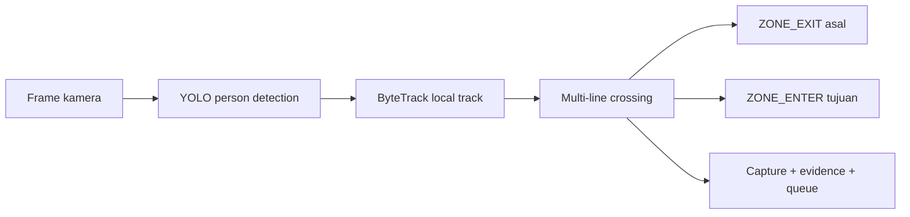

# Phase 5 — Person Detection, Local Tracking, and Zone Transition

Tanggal verifikasi: 24 Juli 2026

Branch: `cctv/versi-1`

Migration head: `0013_local_zone_transitions`

## Hasil

Phase 5 menghubungkan person detection YOLO, local tracking ByteTrack, seluruh
virtual line aktif per kamera, dan histori perpindahan zona yang immutable.



Pipeline tetap mempertahankan timestamp frame/crossing asli. Re-identification
lama tetap dapat menautkan `person_id`, tetapi identitas global dan journey
lintas kamera belum diputuskan pada Phase 5.

## Multi-line runtime

`CameraRepository.list_enabled()` memuat virtual line bersama kamera. Runtime
mengubah setiap line aktif menjadi konfigurasi normalized yang membawa:

- virtual line ID;
- line key dan geometry;
- enter direction;
- from zone ID;
- to zone ID.

Setiap line mempunyai state side, hysteresis, cooldown, dan expiry track sendiri.
Perubahan konfigurasi di PostgreSQL dimuat ulang tanpa me-restart model YOLO,
ByteTrack, atau ReID.

Jika tidak ada virtual line terstruktur, konfigurasi crossing lama pada kamera
tetap menjadi fallback untuk kompatibilitas.

## Arah transisi

Konvensi line:

```text
ENTER: from_zone → to_zone
EXIT:  to_zone   → from_zone
```

Line yang mempunyai kedua sisi menghasilkan pasangan atomik:

```text
ZONE_EXIT(origin) + ZONE_ENTER(destination)
```

Keduanya memakai `transition_id` yang sama. Unique constraint pada
`transition_id + event_type + zone_id`, serta idempotency key per sisi,
mencegah retry membuat transisi duplikat.

Line batas luar yang hanya memiliki satu zona tetap menghasilkan satu
`ZONE_ENTER` atau `ZONE_EXIT`. Perilaku presence lama dipertahankan hanya untuk
batas satu-zona; transisi penuh antarzona sengaja tidak mengubah occupancy lama
karena Occupancy Engine terstruktur merupakan scope Phase 9.

## Local track

Tabel kompatibilitas `trackings` dipertahankan dan berfungsi sebagai local
track. Phase 5 menambahkan:

- `last_seen_at`;
- bounding box terakhir;
- detector confidence;
- direction;
- detector model.

Nama tabel tidak diubah agar foreign key event, evidence, ReID, dan API lama
tidak perlu dimigrasikan secara berisiko. API baru menyebut resource ini
`local-tracks`, sesuai istilah domain target.

## Zone event

Tabel `zone_events` menyimpan:

- idempotency dan transition ID;
- legacy crossing event dan local tracking;
- camera dan virtual line;
- zone, origin zone, dan destination zone;
- `ZONE_ENTER` atau `ZONE_EXIT`;
- local ByteTrack ID;
- direction, centroid, confidence;
- original occurrence timestamp;
- reasoning metadata.

Zone event tidak dihapus ketika seseorang keluar. Foreign key kamera/zona
bersifat restrictive untuk mencegah histori hilang akibat hard delete.

## API

Seluruh endpoint membutuhkan JWT:

```text
GET /api/v1/zone-events
GET /api/v1/zone-events/{event_id}
GET /api/v1/local-tracks
```

Filter zone event:

- camera ID;
- zone ID;
- tracking ID;
- event type;
- rentang waktu;
- offset/limit.

Filter local track:

- camera ID;
- person ID;
- status active;
- rentang waktu mulai;
- offset/limit.

## Backup

Archive observasional naik ke schema version 6 dan menambahkan
`zone_events.jsonl`. Archive schema version 1–5 tetap dapat divalidasi dan
dibaca.

## Struktur file Phase 5

```text
app/
├── api/
│   ├── zone_transition_schemas.py
│   └── routes/zone_transitions.py
├── models/entities.py
├── repository/
│   ├── camera_repository.py
│   ├── pipeline_repository.py
│   └── zone_transition_repository.py
└── services/
    ├── camera_runtime_manager.py
    ├── crossing_service.py
    ├── realtime_pipeline.py
    └── zone_transition_service.py
alembic/versions/0013_local_zone_transitions.py
tests/
├── test_crossing_service.py
├── test_pipeline_repository_presence.py
└── test_zone_transition_routes.py
```

## Verifikasi

- Backend: 185 test lulus.
- Ruff: lulus.
- Migration database kosong: `base → 0013` lulus.
- Rollback database sementara: `0013 → 0012 → 0013` lulus.
- Database sementara sudah dihapus.
- Build production: lulus; API, dashboard, dan PostgreSQL healthy.
- Readiness API: `{"status":"ok"}`.
- Database aktif: `0013_local_zone_transitions`.
- Endpoint zone event dan local track terdaftar pada OpenAPI.
- Data operasional tetap bersih: 1 user dipertahankan, sedangkan camera,
  local track, zone event, dan storage kosong.

## Batas Phase 5

Belum dibangun pada phase ini:

- face/periocular candidate selection dan identity matching (Phase 6);
- full-body ReID dan APD analysis (Phase 7);
- global journey dan multi-camera correlation (Phase 8);
- occupancy engine zona terstruktur (Phase 9);
- policy/security alert (Phase 10);
- dashboard zona final (Phase 11).

Phase 5 hanya menyimpan observation facts. Ia tidak memaksa identitas dan tidak
mengambil keputusan occupancy atau keamanan yang menjadi tanggung jawab phase
berikutnya.
