# Phase 7 — Full-body ReID and PPE Analysis

Tanggal verifikasi: 24 Juli 2026

Branch: `cctv/versi-1`

Migration head: `0015_body_reid_ppe`

## Hasil

Phase 7 menambahkan seleksi full-body candidate, OSNet body
re-identification, dan observasi APD berbasis model YOLO khusus lokasi.
Pekerjaan berat tidak dijalankan pada thread pembaca kamera, tetapi diteruskan
oleh durable PostgreSQL queue.

```mermaid
flowchart LR
    A["Capture + FULL_BODY evidence"] --> B["Face identity correlation"]
    B --> C["BODY_REIDENTIFICATION"]
    C --> D["OSNet embedding 512D"]
    D --> E["pgvector cosine candidates"]
    E --> F["Conservative identity decision"]
    F --> G["PPE_ANALYSIS"]
    G --> H["APD/color observation"]
    H --> I["Capture completed or needs review"]
```



Runtime ReID lama dinonaktifkan secara default melalui
`ENABLE_REALTIME_REID=false`. YOLO person detection, ByteTrack, crossing, dan
capture tetap berjalan realtime; OSNet dan APD diproses setelah evidence aman
tersimpan.

## Full-body candidate

Setiap evidence `FULL_BODY` dinilai berdasarkan:

- confidence person detector;
- luas crop;
- ketajaman Laplacian;
- rasio lebar/tinggi;
- threshold kualitas minimum.

Candidate terbaik yang memenuhi threshold ditandai `selected`. Candidate lain
tetap tersimpan beserta alasan `LOW_QUALITY` atau `LOWER_RANK` agar keputusan
dapat diaudit.

## Body Re-identification

OSNet memakai artifact yang sudah dipin di image production. Checksum artifact,
model version, dimension, dan threshold dicatat di `model_versions`.
Embedding 512 dimensi disimpan pada `body_embeddings` dan dicari menggunakan
HNSW cosine distance pgvector.

Label referensi tidak dibuat dari tebakan body. `person_id` hanya ditempel pada
body embedding bila face match capture yang sama sudah `CONFIRMED`. Keputusan
body:

- `CONFIRMED`: anchor wajah terkonfirmasi pada capture yang sama;
- `PROBABLE`: body similarity melewati threshold dan kandidat tidak ambigu,
  tetapi tetap perlu review atau korelasi Phase 8;
- `CONFLICT`: selisih kandidat pertama dan kedua di bawah ambiguity margin;
- `UNKNOWN`: referensi belum ada atau skor di bawah threshold;
- `UNRESOLVED`: full-body candidate layak tidak tersedia.

Merge/split identitas memindahkan tracking embedding, body embedding, biometric
template, dan hasil match yang terkait sehingga koreksi operator tidak
meninggalkan referensi pada identitas lama.

## APD analysis

Model APD harus berupa bobot YOLO hasil training/validasi lokasi. Class model
dipetakan melalui `PPE_CLASS_MAP` menjadi observation facts, misalnya
`HELMET_PRESENT` atau `HELMET_MISSING`.

Sistem tidak menyimpulkan ketidakhadiran APD hanya karena suatu class tidak
terdeteksi. Status yang disimpan:

- `COMPLETED`: terdapat canonical APD observation;
- `PARTIAL`: model berjalan tetapi belum menghasilkan canonical observation;
- `UNRESOLVED`: crop tubuh tidak layak;
- `MODEL_UNAVAILABLE`: model dimatikan, belum dikonfigurasi, hilang, atau gagal
  diverifikasi;
- `FAILED`: disediakan untuk kegagalan analisis yang dicatat.

Warna dominan torso dicatat terpisah menggunakan HSV sebagai sinyal lemah. Ia
bukan identitas dan bukan keputusan kepatuhan. Policy compliance dan alert
baru dibangun pada Phase 10.

## Database

Migration `0015_body_reid_ppe` menambahkan:

- enum job `BODY_REIDENTIFICATION` dan `PPE_ANALYSIS`;
- modality `BODY`;
- tabel `body_candidates`;
- tabel `body_embeddings` dengan index HNSW cosine;
- referensi body pada `identity_matches`;
- tabel `ppe_analyses`.

Unique constraint per capture/model dan idempotency key queue mencegah retry
menghasilkan keputusan ganda.

## API

Seluruh endpoint membutuhkan JWT:

```text
GET /api/v1/body-analysis/configuration
GET /api/v1/body-analysis/candidates
GET /api/v1/body-analysis/embeddings
GET /api/v1/body-analysis/ppe
```

Endpoint mendukung pagination serta filter capture/person/status. Konfigurasi
publik hanya mengungkap state dan threshold aman; path model, checksum lengkap,
dan raw embedding tidak dikembalikan.

## Backup dan retention

Archive observasional naik ke schema version 8 dan menambahkan body candidate,
metadata body embedding tanpa vector, serta APD observation. Archive versi 1–7
tetap dapat divalidasi.

Backup DR tetap menyertakan database penuh dan storage terenkripsi. Retention
ReID kini membersihkan `PersonEmbedding` lama dan `BodyEmbedding` lama dengan
batas minimum/maksimum per person.

## Struktur file Phase 7

```text
app/
├── ai/body_analysis_service.py
├── api/
│   ├── body_analysis_schemas.py
│   └── routes/body_analysis.py
├── models/entities.py
├── repository/body_analysis_repository.py
└── services/
    ├── ai_processing_worker.py
    ├── body_analysis_service.py
    ├── person_identity_service.py
    └── reid_retention_service.py
alembic/versions/0015_body_reid_ppe.py
tests/
├── test_body_analysis_engine.py
└── test_body_analysis_service.py
```

## Verifikasi

- Backend: 198 test lulus.
- Ruff: lulus.
- Compile check dan whitespace check: lulus.
- Migration database aktif: `0014 → 0015` lulus.
- Rollback terkontrol: `0015 → 0014 → 0015` lulus.
- OSNet production artifact: checksum dapat dibaca dan embedding 512 dimensi
  berhasil dibuat.
- PPE tanpa model site: tercatat jujur sebagai `MODEL_UNAVAILABLE`.
- Endpoint Phase 7 terdaftar pada OpenAPI.
- Data operasional tetap bersih: hanya user bootstrap dipertahankan; kamera,
  capture, job, candidate, embedding, APD analysis, dan storage kosong.

## Batas Phase 7

Belum dibangun pada phase ini:

- global journey dan korelasi multi-camera (Phase 8);
- occupancy engine terstruktur (Phase 9);
- aturan kepatuhan APD dan security alert (Phase 10);
- dashboard operasional final untuk review/alert (Phase 11);
- model APD site-specific dan kalibrasi threshold dari dataset aktual.

Phase 7 menyimpan observation facts dan keputusan identitas konservatif. Ia
tidak mengubah probabilitas body menjadi identitas pasti dan tidak mengklaim
kepatuhan ketika model APD belum tersedia.
