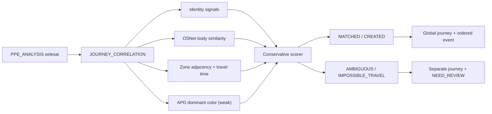

# Phase 8 — Global Journey and Multi-camera Correlation

Tanggal verifikasi: 24 Juli 2026

Branch: `cctv/versi-1`

Migration head: `0016_global_journeys`

## Hasil

Phase 8 menggabungkan local track/capture dari beberapa kamera menjadi global
journey yang dapat diaudit. Keputusan menggunakan event time dan tidak
menyamakan identity hanya karena dua observation berdekatan.



## Event-time correlation

Candidate journey dicari pada jendela `JOURNEY_MAX_GAP_SECONDS`. Anchor terdekat
dapat berada sebelum atau sesudah capture sehingga job yang selesai terlambat
tetap dinilai berdasarkan `captured_at`. Journey event ditampilkan berurutan
menurut `occurred_at`, bukan urutan worker.

Global journey menyimpan:

- journey key;
- kandidat person/external subject;
- identity decision dan confidence;
- first/last seen;
- current zone dan last camera;
- last journey event;
- jumlah event;
- status dan review status.

## Multi-signal decision

Untuk identitas yang diketahui, skor menggabungkan identity, topology, time,
dan appearance. Untuk unknown, bobot appearance/topology lebih besar dan
threshold lebih tinggi.

Hard constraints:

- person/external subject yang bertentangan tidak dapat merge;
- perpindahan antarzona harus memiliki adjacency aktif;
- waktu perjalanan harus berada dalam minimum/maximum route dengan toleransi
  clock skew;
- body similarity di bawah minimum tidak menjadi bukti positif.

Hasil:

- `MATCHED`: capture ditambahkan ke journey yang cukup kuat dan tidak ambigu;
- `CREATED`: belum ada kandidat yang cukup kuat;
- `AMBIGUOUS`: dua kandidat terbaik terlalu dekat, sehingga dibuat journey
  terpisah untuk review;
- `IMPOSSIBLE_TRAVEL`: identitas/appearance relevan ditemukan pada rute fisik
  yang tidak mungkin, tetapi tidak di-merge.

Setiap keputusan menyimpan correlation score, second-best, score per sinyal,
candidate count, anchor event, reasoning metadata, dan idempotency key.

## Concurrency dan idempotency

Correlation transaction memakai PostgreSQL advisory lock singkat. Ini mencegah
dua crossing concurrent melihat state lama lalu membuat duplicate journey.
Candidate journey dan nearest anchor diambil secara batch; vector similarity
juga dihitung oleh pgvector dalam satu query.

Unique constraint memastikan satu capture hanya memiliki:

- satu journey event;
- satu journey correlation.

Retry durable queue mengembalikan record lama dan tidak menambah event count.

## Queue

Rantai asynchronous sekarang:

```text
CAPTURE_INGESTION
→ PERSON_DETECTION
→ IDENTITY_CORRELATION
→ BODY_REIDENTIFICATION
→ PPE_ANALYSIS
→ JOURNEY_CORRELATION
```

`JOURNEY_CORRELATION` menjadi final stage Phase 8. Capture hanya berstatus
`COMPLETED` bila journey tidak membutuhkan review. Phase 9 akan melanjutkan ke
`OCCUPANCY_UPDATE`.

## Database

Migration `0016_global_journeys` menambahkan:

- `global_journeys`;
- `journey_events`;
- `journey_correlations`;
- enum journey status, journey event type, dan correlation decision;
- foreign key, check constraint, unique constraint, dan index pencarian.

Merge person memperbarui journey dan event terkait. Split person memindahkan
event capture yang dipilih dan menandai journey terdampak sebagai identity
`CONFLICT`/`NEED_REVIEW`, sehingga histori campuran tidak dianggap pasti.

## API

Semua endpoint membutuhkan JWT:

```text
GET /api/v1/global-journeys
GET /api/v1/global-journeys/configuration
GET /api/v1/global-journeys/correlations
GET /api/v1/global-journeys/{journey_id}
GET /api/v1/global-journeys/{journey_id}/events
```

List mendukung pagination dan filter person, current zone, last camera, status,
review, rentang waktu, decision, serta impossible-travel.

## Backup

Archive observasional naik ke schema version 9 dan menambahkan
`global_journeys.jsonl`, `journey_events.jsonl`, dan
`journey_correlations.jsonl`. Archive schema 1–8 tetap dapat divalidasi.

## Struktur file Phase 8

```text
app/
├── api/
│   ├── journey_schemas.py
│   └── routes/journeys.py
├── models/entities.py
├── repository/journey_repository.py
└── services/
    ├── ai_processing_worker.py
    └── journey_correlation_service.py
alembic/versions/0016_global_journeys.py
tests/test_journey_correlation_service.py
```

## Verifikasi

- Backend: 204 test lulus.
- Ruff, compile check, dan whitespace check: lulus.
- Multi-camera merge, idempotent retry, unknown strong-body match, identity
  conflict, dan impossible travel: lulus.
- Build image production: lulus.
- Migration aktif: `0015 → 0016` lulus.
- Rollback terkontrol: `0016 → 0015 → 0016` lulus.
- Lima endpoint Phase 8 terdaftar pada OpenAPI.
- Liveness image production: `{"status":"ok"}`.
- Database tetap bersih: hanya user bootstrap; data operasional dan storage
  kosong.

## Batas Phase 8

Belum dibangun:

- occupancy session terstruktur (Phase 9);
- security alert dari impossible travel/duplicate journey (Phase 10);
- manual journey merge/split UI dan dashboard review final (Phase 11);
- access lock sebagai sinyal tambahan (Phase 12).

Phase 8 hanya membentuk perjalanan dan menyimpan correlation evidence.
`IMPOSSIBLE_TRAVEL` belum menjadi alert sampai Policy Engine Phase 10 aktif.
