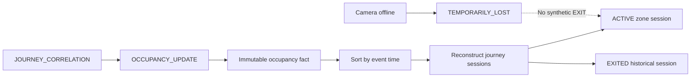

# Phase 9 — Structured Occupancy Engine

Tanggal verifikasi: 24 Juli 2026

Branch: `cctv/versi-1`

Migration head: `0017_occupancy_engine`

## Hasil

Phase 9 membangun occupancy session per zona dari global journey. Source of
truth berupa immutable occupancy facts; session adalah projection yang dapat
direkonstruksi secara deterministik.



## Occupancy facts

Satu journey event menghasilkan paling banyak satu fact:

- `ENTER`;
- `EXIT`;
- `TRANSITION`;
- `OBSERVATION`.

Fact menyimpan journey/camera/zone, subject type, identity decision,
correlation decision, confidence, timestamp asli, dan reasoning metadata.
Unique journey-event dan idempotency key mencegah retry menggandakan input.

## Session reconstruction

Projection engine membaca seluruh fact journey berdasarkan `occurred_at`:

1. target zona pertama membuka session;
2. observation pada zona yang sama memperbarui last seen;
3. target zona berbeda menutup session lama lalu membuka session baru;
4. target zona kosong dari EXIT valid menutup session;
5. EXIT tanpa session terbuka tidak membuat record negatif.

Session ID dibuat deterministik dari journey dan entry journey event.
Capture yang datang terlambat dapat mengubah segmentasi, tetapi hasil akhir
selalu sama untuk kumpulan fact yang sama.

## Subject dan identity

Subject type:

- `EMPLOYEE`: person atau external subject sudah tersedia;
- `UNKNOWN`: identity decision `UNKNOWN`;
- `UNRESOLVED`: unresolved/conflict tanpa kandidat.

Unknown tetap dapat memiliki session `ACTIVE`, namun review status `PENDING`.
Identity probable/conflict juga tidak diubah menjadi confirmed oleh occupancy
engine.

## Camera failure

Kamera offline mengubah structured session terakhir pada kamera tersebut dari
`ACTIVE` menjadi `TEMPORARILY_LOST`. Session tidak ditutup dan `exited_at`
tetap kosong. Observation journey valid berikutnya mengaktifkan kembali
projection.

Legacy midnight reconciliation tetap berjalan hanya untuk tabel kompatibilitas
`presence_sessions`. Ia tidak menyentuh `occupancy_sessions`.

## Queue

Rantai processing Phase 9:

```text
CAPTURE_INGESTION
→ PERSON_DETECTION
→ IDENTITY_CORRELATION
→ BODY_REIDENTIFICATION
→ PPE_ANALYSIS
→ JOURNEY_CORRELATION
→ OCCUPANCY_UPDATE
```

Policy evaluation belum dijalankan. Phase 10 akan menambahkan
`POLICY_EVALUATION` setelah occupancy update.

## Database

Migration `0017_occupancy_engine` menambahkan:

- `occupancy_facts`;
- `occupancy_sessions`;
- enum subject, fact type, dan session state;
- unique active session per journey;
- time/confidence check constraints;
- index filter zona, journey, person, state, dan waktu.

State tersedia:

- `ACTIVE`;
- `TEMPORARILY_LOST`;
- `STALE`;
- `EXITED`;
- `NEED_REVIEW`;
- `MANUALLY_CLOSED`.

Phase 9 otomatis menghasilkan `ACTIVE`, `TEMPORARILY_LOST`, dan `EXITED`.
Stale/manual correction akan memperoleh workflow operator dan audit lengkap
pada phase policy/dashboard.

## API

Semua endpoint membutuhkan JWT:

```text
GET /api/v1/occupancy/configuration
GET /api/v1/occupancy/summary
GET /api/v1/occupancy/sessions
GET /api/v1/occupancy/facts
```

Summary hanya menghitung `ACTIVE` sebagai active total. Temporarily lost,
stale, dan needs-review ditampilkan terpisah.

Dashboard lama masih mempertahankan live visibility untuk kartu “terlihat
sekarang”. Phase 11 akan memisahkan live visibility dan structured occupancy
agar user tidak salah membaca kedua definisi.

## Backup

Archive observasional naik ke schema version 10 dan menambahkan
`occupancy_facts.jsonl` serta `occupancy_sessions.jsonl`. Archive schema 1–9
tetap dapat divalidasi.

## Struktur file Phase 9

```text
app/
├── api/
│   ├── occupancy_schemas.py
│   └── routes/occupancy.py
├── models/entities.py
├── repository/occupancy_repository.py
└── services/
    ├── ai_processing_worker.py
    └── occupancy_service.py
alembic/versions/0017_occupancy_engine.py
tests/test_occupancy_service.py
```

## Verifikasi

- Backend: 208 test lulus.
- Ruff, compile check, dan whitespace check: lulus.
- ENTER, observation, transition, EXIT, orphan EXIT, unknown, dan out-of-order
  reconstruction: lulus.
- Build production: lulus.
- Migration `0016 → 0017`: lulus.
- Rollback `0017 → 0016 → 0017`: lulus.
- Endpoint occupancy terdaftar di OpenAPI.
- Database hanya mempertahankan satu user; occupancy/journey data kosong.
- Storage kosong.

## Batas Phase 9

Belum dibangun:

- policy engine dan security alerts (Phase 10);
- workflow manual close/correction dan dashboard final (Phase 11);
- access-lock correlation (Phase 12);
- benchmark/pilot hardening (Phase 13).

Phase 9 tidak membuat EXIT dari timeout, pergantian hari, atau kamera offline.
