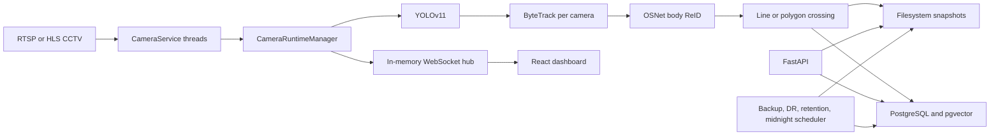
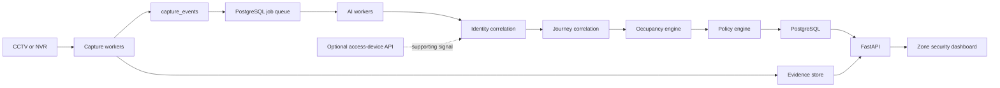
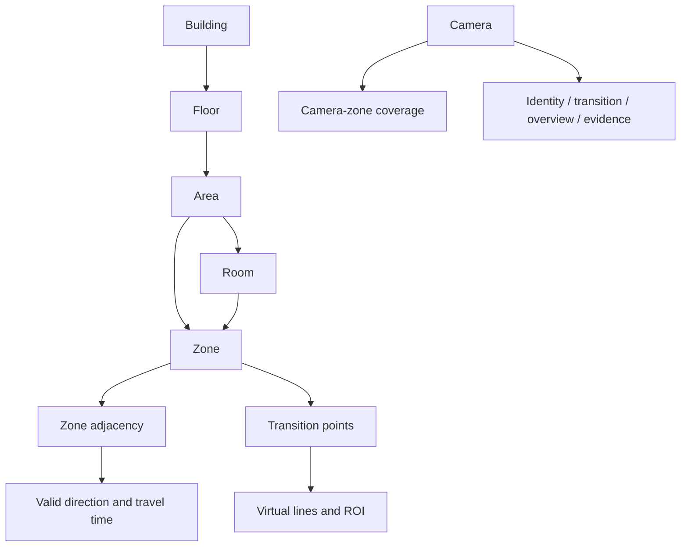
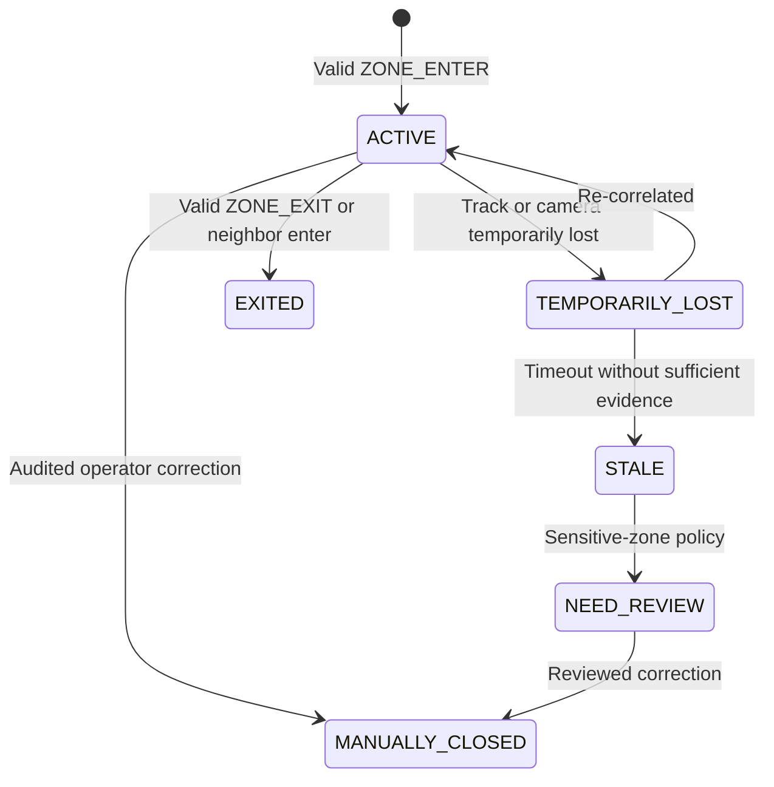

# CCTV Factory Security — Phase 0 Audit and Target Architecture

**Status:** Approved baseline

**Approval date:** 2026-07-23

**Branch:** `cctv/versi-1`
**Scope:** Phase 0 audit, cleanup boundaries, and target architecture for the staged pilot

## 1. Purpose

This document defines the approved baseline for transforming the existing
people-flow prototype into a CCTV-first factory security system. The system
protects sensitive production areas while employees may wear masks and complete
PPE. It does not treat access-lock events as the primary occupancy source and
does not claim that ordinary CCTV can perform true iris recognition.

The implementation uses capture-first and analyze-later processing. Original
event timestamps are preserved even when AI processing finishes later.

No production data, evidence, credentials, or historical migration may be
deleted merely because it is absent from the target design. Deletion requires
reference analysis, runtime analysis, and a passing verification gate.

## 2. Business and Pilot Scope

The long-term installation contains approximately:

- 400 production employees;
- 70 CCTV cameras;
- multiple buildings, floors, rooms, and open production areas;
- department-specific PPE colors;
- restricted zones without depending on physical doors.

The first pilot is intentionally limited to:

- one production area;
- two or three zones;
- three to six cameras;
- 20–40 employees;
- one restricted zone;
- one PPE rule;
- at least one identity-capture camera;
- at least one transition camera;
- at least one overview camera.

Each implementation phase receives its own specification and implementation
plan. This master document is not authorization to implement all phases at
once.

## 3. Non-negotiable Rules

1. Ordinary CCTV supports face, masked-face, periocular, person detection,
   tracking, body re-identification, PPE analysis, zone transition, and evidence
   capture. It does not provide true iris recognition.
2. Face, periocular, body embeddings, images, and video are sensitive data.
3. Identity is never forced when evidence quality is insufficient.
4. Low-confidence AI output cannot be the sole basis for disciplinary action.
5. A person disappearing from a frame is not proof of exit.
6. Exit from active occupancy requires a valid transition, entry into a
   neighboring zone, sufficient multi-camera correlation, or an audited manual
   correction.
7. Historical events remain immutable when a person leaves active occupancy.
8. Every operator correction and evidence access is audited.
9. Processing retry is idempotent and cannot duplicate occupancy or alerts.
10. Every phase must pass its own test, migration, lint, type, build, and
    regression gates.

## 4. Current-State Architecture

FastAPI, camera capture, AI inference, event retry, scheduled jobs, and
WebSocket fan-out currently run in one API process. Tracking, crossing state,
retry events, live visibility, and WebSocket connections are process-local.

### Existing capabilities

- RTSP/HLS camera connection, reconnect, and latest-frame buffering;
- YOLOv11 person detection;
- ByteTrack local tracking;
- horizontal, vertical, and polygon crossing;
- JPEG snapshot plus JSON metadata;
- async SQLAlchemy, PostgreSQL, pgvector, and Alembic;
- OSNet body ReID with HNSW vector search;
- identity merge, split, and embedding retention;
- simple presence sessions;
- FastAPI pagination, filtering, JWT, and role checks;
- user and camera administration;
- WebSocket live monitoring;
- observational ZIP backup;
- encrypted disaster-recovery archives;
- focused unit tests for several existing services.

## 5. Verified Audit Baseline

The read-only audit found:

- 108 Python files that parse successfully on the available Python 3.14
  interpreter;
- 51 test function definitions;
- nine sequential Alembic migrations with `0009_presence_sessions` as the
  migration head;
- 34 files under the runtime storage directory, including snapshots and backup
  archives;
- a clean Git worktree on `cctv/versi-1`.

This is not a passing runtime baseline. The project requires Python 3.12, while
the available host interpreter is Python 3.14 without pytest or ruff. Node.js
and npm are unavailable. Docker build verification could not run because the
Docker daemon was stopped. Test, lint, migration execution, and frontend build
must therefore be rerun in the controlled Python 3.12/Docker environment before
cleanup begins.

## 6. Critical Findings

### 6.1 Active source is ignored by Git

The root `.gitignore` pattern `storage/` also ignores `app/storage`. The active
`SnapshotService` source exists locally but is not tracked. A fresh clone can
therefore lose a required runtime module. The Docker ignore behavior must also
be verified.

Required resolution:

- scope runtime-data ignore rules to `/storage/`;
- explicitly track `app/storage/__init__.py` and
  `app/storage/snapshot_service.py`;
- prove import, test, and Docker build behavior from a clean checkout.

The `app/storage` module must not be deleted.

### 6.2 Evidence is publicly reachable

FastAPI mounts the entire storage directory at `/storage` without an
authorization check. A known snapshot URL bypasses JWT, role checks, access
audit, and evidence-specific authorization.

Required resolution:

- remove the public static mount only after an authenticated replacement is
  tested;
- expose evidence through an authorization service;
- validate paths and immutable object keys;
- issue short-lived signed access;
- audit every preview and download.

### 6.3 Secret posture is unsafe

The local `.env` is untracked but has permission `0644`, and the current JWT
secret matches a placeholder/weak-secret pattern.

Required resolution:

- rotate the JWT secret;
- set local secret-file permission to `0600`;
- reject placeholder secrets when `APP_ENV=production`;
- move production secrets to an external secret mechanism;
- never log RTSP credentials, biometric templates, passwords, or encryption
  passphrases.

## 7. Component Classification

| Component | Classification | Decision |
|---|---|---|
| FastAPI composition root | REFACTOR | Keep HTTP boundary; move capture and AI work out of the API process |
| Pydantic settings | KEEP / REFACTOR | Keep typed environment configuration; add production validation |
| SQLAlchemy async | KEEP | Suitable persistence foundation |
| Alembic migrations 0001–0009 | KEEP | Preserve migration history |
| PostgreSQL and pgvector | KEEP | Store relational metadata and embeddings |
| `app/storage` | SECURITY RISK | Restore active source to version control |
| YOLO detector | KEEP / REFACTOR | Run in AI worker and record model version |
| ByteTrack | KEEP / REFACTOR | Use only for camera-local tracks |
| Crossing service | KEEP / REFACTOR | Use capture timestamps and transition-point context |
| OSNet ReID | KEEP / REFACTOR | Treat as body signal, never sole identity proof |
| Realtime pipeline | REPLACE | Replace with persistent capture-first workflow |
| In-memory event retry | REPLACE | Replace with durable idempotent processing jobs |
| Camera runtime manager | REFACTOR | Convert into shardable capture workers |
| Live visibility registry | REPLACE | Derive operational occupancy from persisted sessions |
| Midnight reconciliation | REPLACE | Do not create synthetic exit without valid evidence |
| Presence sessions | REFACTOR | Evolve into zone and journey-based occupancy sessions |
| Camera building/floor/zone strings | REPLACE | Normalize topology entities and mappings |
| Camera crossing JSON | REFACTOR | Migrate to virtual-line and transition entities |
| Legacy person JSON embedding | REVIEW | Remove only after migration/backfill validation |
| HNSW person embeddings | KEEP | Retain for body ReID candidates |
| Observational ZIP backup | KEEP / REFACTOR | Extend for new schema and evidence classifications |
| Disaster recovery | KEEP / REFACTOR | Preserve encrypted DR and add routine restore evidence |
| JWT and RBAC | REFACTOR | Add role-specific permissions and safer sessions |
| In-memory WebSocket hub | REPLACE | Decouple dashboard updates from one process |
| React dashboard | REFACTOR | Shift from camera-centric to zone/security-centric workflows |
| Docker Compose | REFACTOR | Separate API, capture worker, and AI worker |
| Vite development server | REPLACE | Use production-built static assets behind a hardened server |
| Repository pattern | KEEP / REFACTOR | Retain boundaries while separating domain transactions |
| `TrackingRepository` | REMOVE candidate | No active consumer found beyond package export |
| Empty `app/ai` package | REMOVE candidate | No active reference or behavior |
| `app/main.py` compatibility alias | REVIEW | Confirm no external deployment depends on it |
| Examples | KEEP | Useful isolated documentation and smoke tests |
| Tests | KEEP / EXPAND | Preserve existing tests and add business workflow coverage |
| `.hallmark` metadata | REVIEW | Not runtime-critical; confirm design workflow dependency |
| `.DS_Store`, caches, bytecode | REMOVE | Generated local artifacts only |
| Root `storage/` | KEEP / REVIEW | Contains evidence and backups; never delete as cleanup |

## 8. Current Risks and Defects

1. Crossing timestamps are created at processing time rather than derived from
   the source frame.
2. In-memory retries disappear on restart.
3. A full retry list preserves files without creating a recoverable job.
4. ReID evaluates only one initial crop and may cache failure for the whole
   local track.
5. There is no burst capture or best-candidate selection.
6. An unidentified EXIT may close the wrong occupancy through camera FIFO.
7. Midnight reconciliation creates synthetic EXIT events without transition
   evidence.
8. Live visibility resets with the process and is not authoritative occupancy.
9. Several timezone-aware columns use naive `datetime.utcnow` defaults.
10. Sequential WebSocket fan-out can be delayed by a slow client.
11. Base64 JPEG in JSON increases dashboard bandwidth.
12. CPU/GPU inference competes with API responsiveness in one process.
13. Process-local schedulers complicate multi-worker API deployment.
14. Camera connection testing permits outbound requests to arbitrary hosts and
    requires an egress policy.
15. Dashboard JWT is stored in browser local storage.
16. WebSocket JWT appears in the connection query string.
17. Forced password change is primarily enforced by the UI.
18. Snapshot API exposes internal filesystem paths.
19. A durable capture event does not exist before inference.
20. Model version, correlation ID, global journey, processing freshness, and
    policy-decision records are absent.

## 9. Target Architecture Decision

### Selected queue approach: PostgreSQL-backed jobs

The pilot uses `ai_processing_jobs` claimed with
`FOR UPDATE SKIP LOCKED`. Capture-event creation and job enqueue occur in one
transaction. Job payloads contain references to evidence, never image/video
blobs.

Reasons:

- no additional queue service for the first pilot;
- transactional capture and enqueue;
- durable retry and complete audit history;
- sufficient throughput for three to six pilot cameras;
- straightforward idempotency constraints.

Trade-offs:

- queue indexes and retention must be maintained;
- polling adds controlled database load;
- a dedicated broker may be required after measured 70-camera benchmarks.

The domain depends on a `JobQueue` boundary so a future Redis Streams or other
durable broker adapter does not change capture, identity, occupancy, or policy
logic.

Redis/Celery remains an alternative for measured throughput pressure. Kafka or
NATS is explicitly rejected for the pilot as unnecessary operational
complexity.

## 10. Target Component Architecture

### Service boundaries

**API**

- authentication, authorization, review workflows, and dashboard queries;
- no continuous RTSP loop or GPU inference;
- authenticated evidence delivery.

**Capture worker**

- owns assigned cameras;
- performs lightweight motion/person detection, local tracking, line/ROI
  transition detection, snapshot burst, full-body capture, and clip extraction;
- persists capture metadata and enqueues jobs.

**AI worker**

- selects best face/periocular candidate;
- computes face, periocular, and body embeddings;
- performs PPE analysis;
- records model and preprocessing versions.

**Correlation worker**

- fuses identity candidates;
- joins local tracks into global journeys;
- validates topology and travel time;
- applies occupancy and security policies idempotently.

**Scheduler**

- retention, backup, restore verification, system health reconciliation, and
  controlled reprocessing.

**Evidence store**

- filesystem adapter for the pilot;
- S3-compatible adapter for production;
- immutable keys, checksum validation, encryption metadata, and signed access.

## 11. Area, Zone, and Camera Topology

Camera roles are database configuration. One camera may hold several roles.
Zones may be open areas and do not require a physical door.

Every zone contains:

- building/floor/area/room context;
- polygon or ROI;
- camera coverage;
- transition points and lines;
- neighboring zones;
- allowed departments;
- PPE rules;
- sensitivity;
- processing priority;
- retention policy.

## 12. Target Data Model

### Organization

- `employees`
- `departments`
- `shifts`
- `employee_biometric_references`

### Topology and camera

- `buildings`
- `floors`
- `areas`
- `rooms`
- `zones`
- `zone_adjacencies`
- `cameras`
- `camera_roles`
- `camera_zone_mappings`
- `transition_points`
- `virtual_lines`

### Policy

- `employee_zone_permissions`
- `ppe_policies`
- `zone_policies`

### Capture and processing

- `capture_events`
- `evidence_assets`
- `video_clips`
- `ai_processing_jobs`
- `model_versions`
- `face_candidates`
- `periocular_candidates`
- `body_candidates`

### Identity, tracking, and occupancy

- `identity_matches`
- `identity_decisions`
- `person_embeddings`
- `local_tracks`
- `global_journeys`
- `journey_events`
- `zone_events`
- `occupancy_sessions`

### Security and operations

- `security_alerts`
- `manual_reviews`
- `access_device_events`
- `audit_logs`
- `system_health_events`
- `backup_archives`
- `disaster_recovery_archives`

### Integrity rules

- unique idempotency keys on capture, jobs, zone events, occupancy transitions,
  and alerts;
- a partial unique index prevents duplicate active occupancy for the same
  subject, journey, and zone;
- evidence records use immutable object keys and SHA-256 checksums;
- captured, occurred, queued, processing-started, processed, and
  dashboard-updated timestamps are distinct;
- existing migrations remain intact; new structures use additive migrations
  followed by explicit backfill and compatibility removal.

## 13. Capture and Processing Lifecycle

Statuses:

- `CAPTURED`
- `QUEUED`
- `PROCESSING`
- `COMPLETED`
- `NEED_REVIEW`
- `FAILED`
- `RETRYING`
- `CANCELLED`

Required timestamps:

- `captured_at`
- `processing_started_at`
- `processed_at`
- `dashboard_updated_at`
- calculated `processing_latency`

Jobs also record priority, retry count, lease owner, lease expiration,
idempotency key, failure reason, and model version.

Retry uses exponential backoff. Worker termination returns an expired lease to
`RETRYING`. Exhausted jobs become `FAILED` or `NEED_REVIEW`; they are not
silently discarded.

## 14. Evidence Design

The database stores evidence metadata, not large video binaries:

- immutable key;
- media category;
- MIME type;
- byte size;
- SHA-256 checksum;
- source camera and capture event;
- original capture timestamp;
- encryption metadata;
- retention class;
- legal hold state;
- model/preprocessing version;
- creation and deletion audit.

The evidence store contains:

- original snapshot;
- face crop;
- periocular crop;
- full-body image;
- thumbnail;
- pre/post event clip.

Pilot storage may use a dedicated filesystem volume behind an `EvidenceStore`
interface. Production uses private S3-compatible storage or approved enterprise
object storage with encryption, lifecycle policies, and signed URLs.

## 15. Identity Confidence Model

Identity fuses independent signals:

| Signal | Initial maximum weight |
|---|---:|
| Face, masked-face, or periocular | 40% |
| Body ReID | 20% |
| Camera topology and travel time | 15% |
| Last location and elapsed time | 10% |
| PPE color and type | 10% |
| Shift, department, or access event | 5% |

Unavailable-signal weights are normalized. PPE never establishes identity by
itself. Access-device data is only a supporting signal.

Initial pilot statuses:

- `CONFIRMED`: score at least 0.85, adequate top-two candidate margin, and an
  acceptable biometric signal;
- `PROBABLE`: 0.65 through 0.849;
- `UNRESOLVED`: evidence exists but candidates remain ambiguous;
- `UNKNOWN`: no candidate meets the minimum;
- `CONFLICT`: competing strong candidates or impossible travel.

These thresholds are pilot hypotheses, not permanent truth. They are calibrated
against annotated factory data. The system prefers unresolved identity over a
false confirmed match.

## 16. Journey and Occupancy

Local ByteTrack IDs are scoped to one camera session. Correlation produces a
global journey containing first/last seen time, current zone, last camera,
identity candidates, confidence, event sequence, transition sequence, and review
state.

`STALE` is not `EXITED`. Dashboard counts are computed from configured active
occupancy states. Historical sessions and events remain queryable.

## 17. Policy and Alert Model

Policy domains:

- zone and department authorization;
- PPE color and completeness;
- restricted-zone behavior;
- unknown and unresolved subjects;
- camera availability;
- processing delay;
- identity conflict.

Severity:

- **Critical:** confirmed unauthorized entry into a secret zone, evidence
  tampering, or system-wide capture failure;
- **High:** unknown entry into a restricted zone, identity conflict, impossible
  travel, or critical camera outage;
- **Medium:** PPE mismatch/incomplete, unresolved identity, or sustained
  processing backlog;
- **Low/Info:** noncritical camera outage, recoverable delay, or administrative
  correction.

Every alert records evidence, subject/journey, zone, status, reviewer,
resolution note, confidence, and timestamps.

## 18. API Boundary

Target resource groups:

- `/auth`, `/users`, `/roles`
- `/employees`, `/departments`, `/shifts`
- `/buildings`, `/zones`, `/zone-adjacencies`
- `/cameras`, `/camera-roles`, `/transition-points`
- `/capture-events`, `/processing-jobs`
- `/journeys`, `/zone-events`, `/occupancy`
- `/identity-matches`, `/manual-reviews`
- `/ppe-policies`, `/zone-permissions`
- `/alerts`
- `/evidence/{id}/access`
- `/health`, `/metrics`, `/audit-logs`
- `/access-device-events`

The API never returns raw embeddings or unrestricted filesystem paths.

## 19. Security and Privacy Controls

Minimum controls:

- least-privilege RBAC with Administrator, Security Operator, Security
  Reviewer, Supervisor, Auditor, and Read Only;
- TLS in transit and encryption at rest;
- network separation for CCTV, workers, database, storage, and user-facing API;
- production secret validation and external secret storage;
- authenticated, authorized, and audited evidence access;
- path-traversal and upload protections;
- request and login rate limits;
- model and API version tracking;
- employee offboarding, biometric revocation, re-enrollment, and model migration;
- retention limits and legal hold;
- encrypted backups and recorded restore tests;
- non-root containers, resource limits, and production image scanning.

JWT must not be exposed through WebSocket query strings. Browser session storage
must be redesigned to reduce token theft impact.

## 20. Testing Strategy

### Unit

- virtual-line and polygon crossing;
- occupancy and journey state machines;
- confidence fusion;
- policy evaluation;
- idempotency and retry transitions;
- path and signed-access validation.

### Integration

- PostgreSQL constraints and `SKIP LOCKED` job leasing;
- pgvector candidate search;
- Alembic upgrade from the current head;
- evidence-store adapter;
- backup and restore compatibility.

### End-to-end

- zone A to zone B;
- enter, exit, temporarily lost, and re-correlation;
- unknown, unresolved, and identity conflict;
- unauthorized zone and PPE mismatch;
- operator review and manual correction;
- camera outage, worker termination, storage failure, and database interruption.

### AI evaluation

- fixed annotated clips from actual PPE and mask conditions;
- person detection precision/recall;
- crossing and direction accuracy;
- false-match and unknown rates;
- body ReID identity switches;
- PPE false-alert review.

### Load and resilience

- scale from three to six pilot cameras before 12, 24, and 70-camera tests;
- measure CPU, GPU, VRAM, database queue latency, storage throughput, and network;
- prove that retry produces zero duplicate occupancy and alerts.

## 21. Pilot Acceptance Metrics

Initial acceptance targets:

- zero duplicate occupancy or alerts caused by retry;
- zone-crossing direction accuracy of at least 95%;
- occupancy error no greater than one person per pilot zone;
- confirmed identity precision of at least 99.5%;
- unauthorized-alert precision after review of at least 95%;
- zero referenced evidence assets that cannot be retrieved;
- capture failure below 1%;
- high-priority P95 processing latency below 60 seconds;
- normal-priority P95 processing latency below five minutes;
- camera uptime of at least 99% during the pilot window;
- 100% of manual corrections recorded in audit logs;
- a successful recorded restore test before pilot readiness.

## 22. Cleanup Plan and Safety Gates

### Group A — source and generated artifacts

1. Correct root-only storage ignore rules.
2. Track active `app/storage` source.
3. Remove only local generated artifacts such as `.DS_Store`, cache directories,
   and bytecode.
4. Verify a clean-checkout import and Docker build.

### Group B — immediate security foundation

1. Rotate weak development secrets without committing their values.
2. Add production configuration validation.
3. Replace public evidence access with an authenticated compatibility endpoint.
4. Add evidence access audit.
5. Test authorization and path traversal before removing the old static mount.

### Group C — dead-code candidates

1. Prove no import, runtime, test, build, or deployment references.
2. Remove the empty AI package and unused tracking repository only when proof is
   complete.
3. Retain `app/main.py` until external entry-point usage is resolved.

### Group D — architectural replacement

Realtime pipeline, midnight reconciliation, camera topology strings, legacy
presence behavior, and dashboard counters are replaced phase by phase. Additive
migrations and compatibility readers precede removal.

### Verification after every group

- Python 3.12 tests;
- ruff lint;
- Alembic upgrade on a disposable database;
- backend image build;
- frontend production build;
- regression tests;
- clean Git status;
- documented deletion manifest and rollback notes.

## 23. Implementation Decomposition

The approved program is divided into separate specs and plans:

1. Phase 0 cleanup and security-critical foundation.
2. Application/database/configuration foundation.
3. Building, zone, camera, topology, and virtual-line configuration.
4. Capture events and evidence storage.
5. Durable asynchronous processing jobs.
6. Person detection, local tracking, and zone transition.
7. Face/periocular candidate selection and identity matching.
8. Body ReID and PPE analysis.
9. Global journey and multi-camera correlation.
10. Occupancy engine.
11. Policy engine and alerts.
12. Zone security dashboard.
13. Optional access-device correlation.
14. Hardening, benchmark, restore test, and pilot deployment.

No later phase begins while its dependency phase is unstable.

## 24. Assumptions and Risks

- Camera and application hosts use synchronized NTP.
- NVR APIs or stream buffering determine whether reliable pre-event clips are
  available.
- Camera placement and pixel density may limit face/periocular recognition.
- Similar PPE increases body ReID ambiguity and makes topology essential.
- Employee reference photos require lawful collection, consent/policy, quality
  standards, and offboarding controls.
- Storage sizing depends on clip duration, event frequency, retention, and
  evidence resolution.
- Network bandwidth and GPU requirements must be measured rather than inferred
  from camera count alone.
- Model and dataset licenses require legal review.
- Backup stored on the same server does not provide disaster recovery.
- A filesystem evidence adapter is acceptable only for the pilot; multi-node
  production requires shared object storage.

## 25. Approval Gate

This document authorizes preparation of the Phase 0 cleanup implementation plan.
It does not authorize deletion of evidence, migration history, production data,
credentials, or any component classified as REVIEW. Each destructive or
hard-to-reverse action requires explicit target validation and a verified
rollback path.
